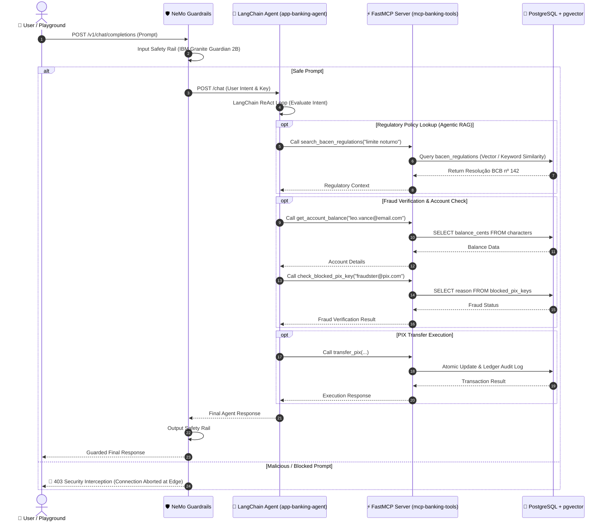

# 🤖 app-banking-agent

> **Autonomous Banking Agent Microservice**: High-performance Python agentic microservice built on **LangChain ReAct / OpenAI Tools Agent**, seamlessly integrated with the **FastMCP Banking Tools Server** (`mcp-banking-tools`) and **PostgreSQL `pgvector` Agentic RAG**.

---

## 🎯 Architectural Overview & Design Thesis

The `app-banking-agent` microservice serves as the core intelligence engine in the agentic banking framework. It orchestrates tool invocations, user intent evaluation, and financial policy lookup under strict determinism.



---

## 🏛️ Code Architecture & Module Explanation

### 1. `src/agent.py` — LangChain ReAct Agent Loop
- **Function**: `create_banking_agent(model_name, api_base)`
- **Mechanism**: Instantiates `ChatOpenAI` configured for Ollama / Qwen 2.5 3B (`http://qwen-engine-service:11434/v1`). Uses `create_openai_tools_agent` and wraps it in a robust `AgentExecutor` with `max_iterations=5` and `handle_parsing_errors=True`.
- **System Prompt Rules**: Enforces strict financial rules: mandatory account balance lookup prior to transfers, mandatory fraud registry check, cents monetary conversion (e.g. R$ 50,00 = 5000 cents), and automatic Agentic RAG invocation for regulatory queries.

### 2. `src/mcp_client.py` — FastMCP & Database Tool Definitions
Exposes 4 production tools using LangChain's `@tool` decorator:
- `get_account_balance(pix_key: str)`: Queries PostgreSQL `characters` table for current balance (BRL & cents) and risk profile.
- `check_blocked_pix_key(pix_key: str)`: Verifies recipient against the BACEN Central Bank fraud registry (`blocked_pix_keys`).
- `transfer_pix(origin_pix_key: str, destination_pix_key: str, amount_cents: int)`: Executes atomic monetary transactions, updating balances and appending audit records to `transactions`.
- `search_bacen_regulations(query: str)`: **Agentic Mock RAG Tool**. Queries the PostgreSQL `bacen_regulations` table (equipped with `pgvector`) to fetch Central Bank policy resolutions (e.g., **BCB-142** for night transfer limits and **BCB-103** for MED fraud recovery).

### 3. `src/main.py` — FastAPI Microservice Entrypoint
- Exposes high-throughput HTTP routes:
  - `GET /health`: Healthcheck & agent readiness status.
  - `POST /chat`: Primary chat endpoint processing user prompts.
  - `POST /rag/search`: Direct API testing endpoint for the Agentic RAG tool.

---

## 📡 API Specifications

### 1. `POST /chat`
**Request Body**:
```json
{
  "message": "What is the PIX nighttime transfer limit?",
  "origin_key": "leo.vance@email.com"
}
```
**Response Body**:
```json
{
  "status": "success",
  "reply": "According to Central Bank Resolution BCB Resolution No. 142 retrieved via regulatory search, the standard default limit for PIX transfers during nighttime hours (from 20:00 to 06:00) is set to R$ 1,000.00."
}
```

### 2. `POST /rag/search`
**Request Body**:
```json
{
  "query": "PIX nighttime limit"
}
```
**Response Body**:
```json
{
  "status": "success",
  "query": "PIX nighttime limit",
  "match_count": 1,
  "regulations": [
    {
      "resolution_code": "BCB-142",
      "title": "PIX Nighttime Transaction Limits",
      "category": "pix_limits",
      "content": "According to Central Bank Resolution BCB Resolution No. 142, the standard default limit for PIX instant transactions executed by individuals during nighttime hours (from 20:00 to 06:00) is set to R$ 1,000.00."
    }
  ]
}
```

---

## 🧪 Local Setup & Testing

### 1. Install Dependencies
```bash
python -m venv .venv
source .venv/bin/activate  # Or .venv\Scripts\activate on Windows
pip install -r requirements.txt
```

### 2. Run Unit Test Suite
```bash
pytest -v tests/
```

### 3. Start Local Microservice
```bash
uvicorn src.main:app --reload --port 8002
```

---

## ⚙️ CI/CD & Automated Code Quality

This repository uses GitHub Actions (`.github/workflows/ci.yml`) enforcing a 2-Stage Pipeline:
1. **Stage 1 (Code Quality & Security)**: Executes `ruff check`, `black --check`, `bandit` SAST security scanning, and `pytest` unit tests.
2. **Stage 2 (Multi-Arch Container Publish)**: Builds multi-architecture (`linux/amd64`, `linux/arm64`) Docker images and pushes to GitHub Container Registry (`ghcr.io/gabsgoms10/app-banking-agent:latest`) with GHA layer caching.
